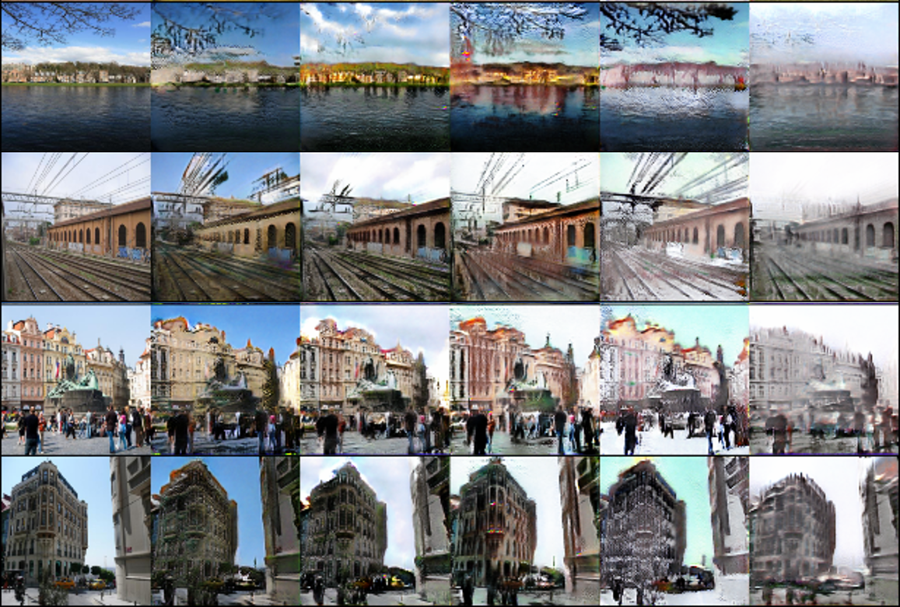
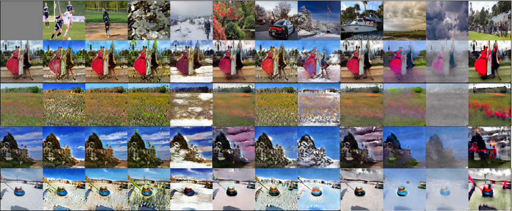

# cUNet-Pytorch
This is pytorch implementation of conditional U-Net.

# 1. 動作環境
cuda 10.2
nvidia-driver 455.23.05
ubuntu 18.04
python3.*
pytorch > 1.7

## 1.1 仮想環境の構築
### 1.1.1 Pipenv
In this dir,
```
pipenv install --skip-lock
```

### 1.1.2 Docker (推奨)
Docker環境を使用すれば，amp学習と分散(distributed)学習が可能になる．
ampとdistirubutedを併用すれば学習速度が10倍くらいになる．
```
cd docker

# イメージの作成
docker build -t [image name] .
# weahter_transferはtorch18_takamuro
# style_transferは torch041_styletransfer

# コンテナの作成
docker run -v /mnt/SSD2T/takamuro/:/mnt/HDD8T/takamuro -v /mnt/fs2:/mnt/fs2 -v /mnt/HDD8T/takamuro/m2/Weather_UNet_v2/:/home/sota/data/m2/ --gpus all --name [container name] --shm-size 16G -it [image name] bash

# イメージの一覧
docker images

# コンテナの一覧
docker ps --all

# 起動しているコンテナの一覧
docker ps

# コンテナの起動
docker start [container name]

# コンテナに入る
docker exec -it [container name] bash
# weather_transferは weatherUNetV2
# style_transferは photowct
```

# 2. Train
## 2.0 共通のargs
- `--image_root` : データセットの画像へのパス
- `--i2w_root` : Image2Weatherの画像へのパス
- `--csv_root` : 気象信号値のcsvへのパス
- `--pkl_path` : 学習データを指定しているpklへのパス
- `--i2w_pkl_path` : I2Wのpklへのパス
- `--dataset` : 使用するデータセットの名前(flicker, i2w, celebA)
- `--gpu` : gpu id　複数のgpuを使用する場合は複数記述 (ex. 0,1,2,3)
- `--multi_gpu` : 分散学習では無いマルチgpuの学習を行う際のフラグ
- `--amp` : amp学習のフラグ
- `--name` : 保存するときのプロジェクトの名前
- `--save_dir` : checkpointを保存するdirの名前

詳細はargs.pyを参照

## 2.1 Classifier and estimantor training
メインのコードは predictor.py

### 2.1.1 Classifier training

```
python train_classifier.py --gpu [gpu id] --cls_save_dir [checkpoints save dir] -bs [batch size] --predictor [network name] --dataset [dataset name]
```
追加オプション

- --pre_trained : imagenetの重みを使ってfine-tuningするときのフラグ

### 2.1.2 Estimator training

```
python train_estimator.py --gpu [gpu id] --est_save_dir [checkpoints save dir] -bs [batch size] --predictor [network name]
```
追加オプション

- --pre_trained (ImageNet weight)

## 2.2 Transformer training
t_*_train.py が画像変換器の学習コード
nameが同じであれば，基本的に学習は最新のcheckpointから再開される．
- `--resume_cp` : 学習を再開するcheckpointへのパスを指定 
- `--wloss_type` : どのweather lossを使用するか指定する．
- `--GD_train_ratio` : GeratorとDiscriminatorの学習の比率を設定する．5だとGが一回学習する間にDは5回学習する．

classifer : クラス分類器
estimator : 信号値推定器

### 2.2.1 Class transformer
classでの変換器の学習は以下のコードとコマンド
```
python t_cls_train.py --gpu [gpu id] --classifier_path [path to classifier checkpoint] -bs [batch size] --dataset [dataset type] --GD_train_ratio [training ratio of discriminator and generator] --disc [discriminator network] --samper [sampler type]
```

### 2.2.2 Signal transformer
信号値での変換器の学習は以下のコード
```
python t_est_train.py --gpu [gpu id] --estimator_path [path to estimator checkpoint] -bs [batch size] --dataset [dataset type] --GD_train_ratio [training ratio of discriminator and generator] --disc [discriminator network] --samper [sampler type]
```

### 2.2.3 Sequence transformer
シーケンスでの変換器の学習は以下のコード
```
python t_seq_train.py --gpu [gpu id] --estimator_path [path to estimator checkpoint] -bs [batch size] --dataset [dataset type] --GD_train_ratio [training ratio of discriminator and generator] --seq_disc [3d discriminator network] --samper [sampler type]
```
追加のargs

- `--seq_len` : シーケンスの長さ (ミニバッチがseq_len * batch_sizeになるので，バッチサイズ8だと12*8で96になり，gpuに乗り切らないので，bsを下げる)
- `python -m torch.distributed.launch --nproc_per_node=[NUM_GPUS] t_[ANY_TRAIN_CODE].py --amp --gpu [gpu id 使う分だけ] args []` : 分散学習のコマンド
分散学習時はampとの併用がおすすめ．
分散学習を行う時はsamplerを使えない．実際にはdistribute用のsamplerが使用されているので，それと組み合わせたsamplerを自作すると使えないことはない．
分散学習時のbsは一枚のgpuに乗せる値なので，1か2か3くらいになる．
## 2.3 Sampler
samplerについて，クラス(晴れ，曇り，雨，雪，霧)がミニバッチ内で均等にするImbalancedDatasetSamplerと
時間帯(0~5, 6~11, 12~17, 18~23　※調整可能)がミニバッチ内で均等にするTimeImbalancedDatasetSamplerがある．
sampler.pyで実装

## 2.4 Others
ipynb内に学習データの作成や分析に使ったjupyterのファイルがある．
sh内のwrite_image_summary.pyを使えば，指定したtensorboardに保存された画像を任意のdirに出力できる．

# 3. Test codes
全部checkpointへのパスと出力のパスをargsで指定すると動作する．
評価用のコードはevalの中にある．
- eval_class_trainsfer_all_cp.py : classのtransferの全checkpointを対象にテストするコード
- eval_class_transfer.py : 任意のcheckpointのclass_transferについてテストするコード
- eval_classifier_celeba.py : celebaで学習したclassifierをテスト
- eval_classifer_i2w.py : i2wで学習したclassifierをテスト
- eval_estimator_transfer_all_cp.py : 信号値のtransferの全checkpointを対象にテスト
- eval_estimator_transfer.py : 任意のcheckpointのest_transferについてテスト
- eval_estimator.py : estimatorのテストコード
- eval_seq_transfer.py : シーケンスのtranferの変換前後の信号値でmaeとmseでテストするコード
- fid_score.py : 対象の画像群でfidを計算するコード
- inception_score.py: inception scoreを計算するコード

# 4. Inference codes
推論用のコードはinfeneceの中にある．
主にestimatorやclassifierで画像に対する推定クラスや信号値を出力したり，
transferの出力画像を保存するコードがある．
全部checkpointへのパスと出力のパスをargsで指定すると動作する．

- inf_classifier.py : i2wで学習したclassifierの推定結果を保存するコード
- inf_estimator.py : estimatorの推定結果を画像とpklで保存するコード
- inf_transfer_c.py : classで画像を変換するコード
- inf_transfer_celeba.py : celebaの画像を変換するコード
- inf_transfer_e_all_sig.py : 信号値を10段階に分割し，全種類の信号値をそれぞれ変えて画像を変換するコード
- inf_transfer_e_MakeVid.py : 画像列に変換するコード
- inf_transfer_e.py : pklに保存された信号値を用いて画像を変換するコード

You can train or test conditional image transformation with semi-supervised learning.


- Paper: coming soon
- Pre-trained model: coming soon

- distributed train command
`python -m torch.distributed.launch --nproc_per_node=[NUM_GPUS] t_[ANY_TRAIN_CODE].py --amp args []`